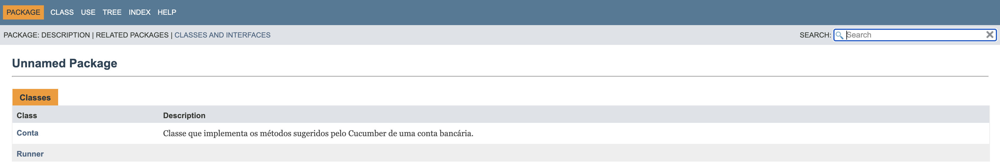
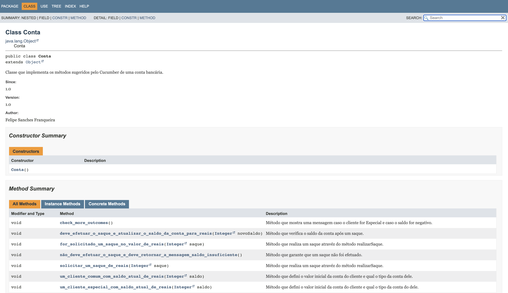

# Behavior Driven Development - Conta Bancária
## Descrição
Este projeto se trata de um estudo sobre Behavior Driven Drevelopment (BDD) utilizando a Cucumber, 
BDD é uma prárica onde definimos senários com especificações de situações do mundo real, e a partir 
dessas especificações desenvolvemos o código a ser testado. 
Para este estudo foi criado a classe `arquivo_teste.feature` contendo alguns senários junto das suas 
especificações para uma conta bancária, após rodar o Cucumber nos informou alguns métodos a serem 
implementados. A implementação desses métodos está na classe `Conta` junto de toda a lógica para atender
as especificações dos senários do BDD. Por fim foi criada a classe `Runner` para testar se a implementação
dos métos e da lógica está correta baseado nos senários e suas especificações.

## Arquivo de Testes
Abaixo está as imagems do console após execução do arquivo de testes criado utilizando a biblioteca Cucumber.
Aprimeira imagem se trata do resultado antes da implementação dos métodos, e a segunda após a implementação deles.

## Classe Runner
Abaixo está as imagens do console após a execução da classe `Runner`. A primeira representa um erro, e a segunda 
caso tudo tenha dado certo.

## Documentação
Foi gerado o JavaDoc do projeto, abaixo está algumas imagems dele.

## Ultima atulização 16/11/2023